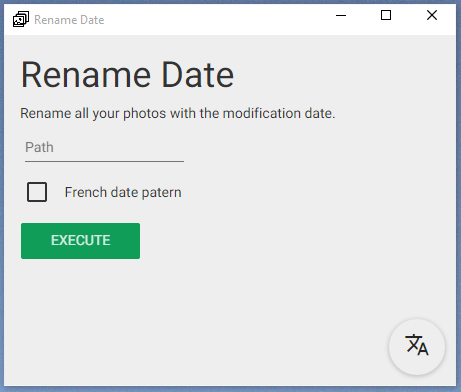

# Rename Date for Desktop

Rename all your photos with the modification date.

## Installation

1. [Download for Windows](https://raw.githubusercontent.com/cedced19/rename-date/master/desktop/dist/Windows.zip)
2. Extract
3. Execute `rename-date.exe`



## To compile

```
npm install
gulp
```